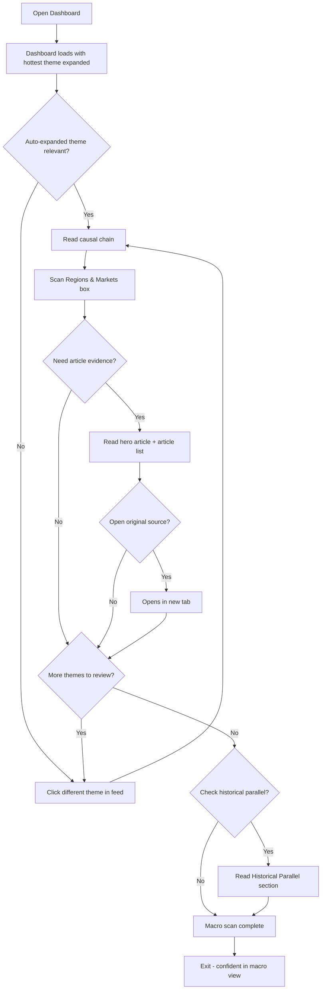
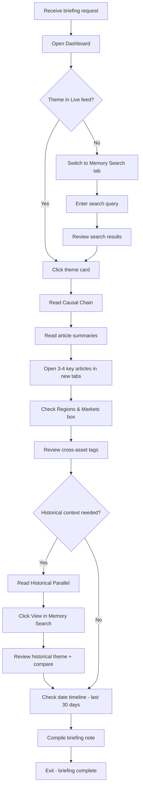

---
stepsCompleted:
  - step-01-init
  - step-02-discovery
  - step-03-core-experience
  - step-04-emotional-response
  - step-05-inspiration
  - step-06-design-system
  - step-07-defining-experience
  - step-08-visual-foundation
  - step-09-design-directions
  - step-10-user-journeys
  - step-11-component-strategy
  - step-12-ux-patterns
  - step-13-responsive-accessibility
  - step-14-complete
status: 'complete'
completedAt: '2026-03-08'
inputDocuments:
  - 'prd.md'
  - 'architecture.md'
workflowType: 'ux-design'
project_name: 'FinTech_Hackathon'
user_name: 'Aanya'
date: '2026-03-08'
ux_inspiration:
  - 'Bloomberg Terminal'
  - 'AlphaSense'
---

# UX Design Specification FinTech_Hackathon

**Author:** Aanya
**Date:** 2026-03-08

---

<!-- UX design content will be appended sequentially through collaborative workflow steps -->

## Executive Summary

### Project Vision

An AI-powered macro intelligence dashboard for Singapore-based asset managers that transforms fragmented news into actionable macro intelligence. Inspired by the information depth of Bloomberg Terminal and the clean AI-powered search of AlphaSense, but differentiated by LLM-powered causal chain reasoning and accessible temperature-based theme scoring.

### Target Users

- **Rachel Tan (Portfolio Manager):** Time-poor senior PM managing $500M multi-asset portfolio. Needs to scan today's macro landscape in <5 minutes during her 7:30-9:30am window. Values speed and signal clarity over data density.
- **David Lim (Junior Analyst):** Research analyst building briefing notes and learning second-order macro connections. Needs deep-dive capability with article trails, causal chains, and historical context. Values completeness and source attribution.

### Key Design Challenges

1. **Information density vs. scannability:** Asset managers need Bloomberg-level depth accessible through a clean, scannable interface. Solved via progressive disclosure — minimal feed cards, rich detail panel on expand.
2. **Causal chain readability:** The Trigger → Mechanism → Asset Impact reasoning is novel — no standard UX pattern exists. Needs a visual format that's instantly parseable and creates a "wow" moment for judges.
3. **Two-level depth:** Rachel's 30-second scan and David's 40-minute deep dive must coexist in the same interface without compromise.

### Design Opportunities

1. **Dark, terminal-aesthetic theme:** Bloomberg-inspired dark UI signals "professional financial tool," differentiates from typical hackathon projects, and reduces eye strain for desktop use.
2. **Causal chain as visual flow:** Render Trigger → Mechanism → Asset Impact as a connected visual chain rather than plain text — an instantly recognizable differentiator.
3. **Temperature as color language:** Hot (red/orange), Warming (amber/yellow), Cool (blue/teal) creates instant visual hierarchy across the dashboard.

### Key UX Decisions

- **Feed cards are minimal:** Theme name, temperature badge, article count, recency only. No tags cluttering the scan view.
- **Progressive disclosure:** Region/asset tags and all detail content revealed only in the expanded detail panel.
- **Tags as filters + detail context:** Region and asset class tags serve as filter mechanics at the top of the feed, and appear as small badges in the detail panel — not on feed cards.
- **Hybrid layout:** Feed on the left, expandable detail panel on the right. User never loses feed context while exploring a theme.

## Core User Experience

### Defining Experience

**Core Action:** Scan the theme feed and decide what demands attention. The entire product revolves around this moment — Rachel opens the dashboard and within 30 seconds knows what matters today.

**Core Interaction:** Theme card → expand detail panel. This is the value transition point — from "what happened" to "why it matters." Must feel instant and seamless.

**Layout:** Hybrid split-view — theme feed (left), detail panel (right). Hottest theme auto-expanded on load so the dashboard delivers intelligence the moment it renders. No empty states on first view.

### Platform Strategy

- Desktop web SPA (Chrome), minimum 1280px viewport
- Mouse/keyboard primary interaction
- No offline, no mobile, no cross-browser — hackathon prototype
- Dark terminal-aesthetic theme for professional financial tool positioning

### Effortless Interactions

- **Auto-sorted feed:** Themes always ranked by temperature — hot first. No manual sorting needed.
- **Auto-expanded hottest theme:** Dashboard loads with the most critical theme already open in the detail panel. Rachel sees intelligence immediately — zero clicks to first insight.
- **One-click depth:** Single click on any theme card swaps the detail panel. No page navigation, no loading screens, no context loss.
- **Causal chain front and center:** The detail panel leads with the causal chain — the differentiator is the first thing you see, not buried below articles.
- **Visual hierarchy in detail panel:** Top article displayed with a large hero image for visual impact and immediate context. Remaining articles show small thumbnails (from Open Graph meta tags, fallback to source publication logo). Adds visual drama without cluttering the minimal feed cards.

### Critical Success Moments

1. **First load "wow":** Dashboard opens with hot themes sorted, detail panel showing hero image and causal chain for the hottest theme. Rachel thinks "I already know what matters today" — before she's even clicked anything.
2. **Causal chain "aha":** Rachel reads *"MAS tight NEER band → SGD appreciation → export pressure → STI underperformance"* and immediately sees the second-order connection she would have spent 45 minutes piecing together.
3. **Historical parallel discovery:** Below the causal chain, a "Reading Suggestions" section surfaces historical parallels from institutional memory — *"Similar pattern: MAS tightening cycle Q3 2024 — here's what followed."* This is the moment the product proves it has memory and context that no competitor offers.
4. **David's deep dive payoff:** David searches institutional memory (separate tab), finds a past theme with its full article trail and archived causal chain, and directly references it in his briefing note. 40 minutes instead of 2.5 hours.

### Navigation Structure

- **Two tabs:** "Live Themes" (default) and "Memory Search"
- **Live Themes tab:** Theme feed (left) + detail panel (right) with hybrid split-view
- **Memory Search tab:** Search bar + historical theme results with archived causal chains and article trails

### Experience Principles

1. **Intelligence on arrival:** The dashboard should deliver value before the user clicks anything. Auto-sort, auto-expand, pre-generated causal chains.
2. **Progressive disclosure:** Minimal feed cards → rich detail panel (hero image, causal chain, articles) → historical parallels. Each layer adds depth only when the user asks for it.
3. **Context preservation:** The feed never disappears. Expanding a theme doesn't navigate away — Rachel always sees the full landscape while drilling into one theme.
4. **Speed is trust:** Every interaction must feel instant. If the dashboard is slow, asset managers won't trust it. Cache-first, pre-generated content, no loading spinners on primary views.

## Desired Emotional Response

### Primary Emotional Goals

**For Judges (primary audience):**
- **"This is a real product"** — professional polish, dark terminal aesthetic, real data flowing. The dashboard should feel like it belongs on a trader's desk, not in a classroom.
- **"I haven't seen this before"** — the causal chain visual flow is the "wow" moment. It should be visually distinctive and immediately comprehensible within 10 seconds.
- **"This actually works"** — live data, real themes, real articles with images. Nothing mocked or hardcoded-looking. Credibility through authenticity.

**For Asset Managers (product users):**
- **Confidence:** "I have the full picture and I'm not missing anything."
- **Empowerment:** "I can see connections I wouldn't have found on my own."
- **Trust:** "This tool is reliable and remembers what I forget."

### Emotional Journey Mapping

| Moment | Judge Feels | Design Driver |
|---|---|---|
| First 3 seconds | "This looks professional" | Dark theme, clean typography, real data, no empty states |
| First 10 seconds | "I understand what this does" | Auto-expanded hottest theme with causal chain visible, clear temperature badges |
| First 30 seconds | "That's clever" | Causal chain visual flow — Trigger → Mechanism → Asset Impact. Something novel they haven't seen in other submissions |
| First 60 seconds | "This works with real data" | Recognizable news sources, real article images, live timestamps |
| During demo | "They thought this through" | Historical parallels in reading suggestions, smooth split-view navigation, graceful degradation |

### Micro-Emotions

**Critical to get right:**
- **Trust over skepticism:** AI-generated content clearly labeled with disclaimers. Real news sources with attribution. "Last updated" timestamps everywhere. Judges should never wonder "is this real data?"
- **Clarity over confusion:** Every element has an obvious purpose. Temperature colors are self-explanatory. The causal chain reads like plain English, not jargon.
- **Polish over excitement:** Hackathon projects often look flashy but fragile. This should feel calm, confident, and solid — like it just *works*.

**Emotions to actively avoid:**
- **Overwhelm:** Too many tags, panels, or data points
- **Distrust:** Generic-sounding AI output, unexplained elements
- **"Student project" feeling:** Default styling, placeholder data, loading spinners, empty states

### Design Implications

- **"Real product" feeling** → Dark theme with consistent color palette, professional typography (system fonts or clean sans-serif), proper spacing and alignment
- **"I haven't seen this before"** → Causal chain rendered as a visual connected flow (not just text), hero article images for visual richness
- **"This actually works"** → Real article thumbnails from news sources, recognizable publication names, live timestamps that match current date
- **"They thought this through"** → Smooth transitions between theme cards and detail panel, reading suggestions that surface historical context, no janky UI states
- **Trust signals** → "AI-Generated" badges on all AI content, financial disclaimer, source attribution on every article, "Last updated: 2 minutes ago" timestamps

### Emotional Design Principles

1. **Polish wins hackathons.** A clean, professional UI with real data beats a feature-packed but rough prototype. Invest in visual quality over feature quantity.
2. **The "wow" must be visible in 10 seconds.** The causal chain — the primary differentiator — must be visible without scrolling or clicking on first load.
3. **Credibility through authenticity.** Real news sources, real images, real timestamps. Nothing should look fake or placeholder.
4. **Calm confidence, not flashy excitement.** Financial tools should feel trustworthy and solid, not playful or animated. Minimal transitions, no bouncing elements, no gratuitous motion.

## UX Pattern Analysis & Inspiration

### Inspiring Products Analysis

**Bloomberg Terminal** — The gold standard for financial data density. Dark theme, color-as-signal, real-time credibility. But overwhelming UX and zero plain-language intelligence. We take the aesthetic seriousness, leave the complexity.

**AlphaSense** — Best-in-class AI-powered financial search. Clean card-based results, progressive disclosure, trending topics. But search-first (users must know what to look for) and no causal reasoning. We take the information layering, leave the search-first model.

**TradingView** — The most accessible professional financial tool. Beautiful dark theme execution, split-view layout, clean charts that non-experts can read. We take the visual polish and layout pattern, leave the charting complexity.

### Transferable UX Patterns

**Navigation — Adapted from TradingView's split-view:**
- Feed (left, ~30% width) + detail panel (right, ~70% width)
- Adapted: Our feed is simpler than TradingView's watchlist — just theme name, temperature, article count. Detail panel is richer — causal chain, hero image, articles, timeline, reading suggestions.

**Information Hierarchy — Adapted from AlphaSense's progressive disclosure:**
- AlphaSense: search result snippet → full document → highlighted section
- Adapted: Minimal theme card → detail panel (causal chain + hero image + articles) → historical parallels in reading suggestions. Three layers of depth, each revealed by user action.

**Temperature Scoring — Adapted from Bloomberg's color-as-signal:**
- Bloomberg: red/green for price direction — universally understood
- Adapted: Hot (red/orange glow), Warming (amber/yellow), Cool (blue/teal). Temperature metaphor is even more intuitive than price direction — requires zero financial knowledge to understand. Applied as badge color on feed cards and as accent color throughout the detail panel.

**Chart Design — Adapted from TradingView's clean charts:**
- TradingView: dark-background charts with subtle gridlines, clear axis labels, hover tooltips
- Adapted: Our interactive date timeline uses the same dark aesthetic — showing the last 30 days with epicenter heat dots indicating critical activity dates. No complex candlesticks or indicators. Clean labels, dark background matching the dashboard theme.

**Data Cards — Adapted from AlphaSense's document cards:**
- AlphaSense: source, date, AI-highlighted snippet, click to expand
- Adapted: Our article cards show thumbnail image, title, source name, date, one-line AI summary, click to open original source. Smaller thumbnails for article list, hero image for the top article.

**Dark Theme — Adapted from TradingView's modern execution:**
- Bloomberg's dark theme is functional but dated. TradingView's is modern — clean spacing, subtle borders, proper contrast ratios.
- Adapted: Dark background (#1a1a2e or similar deep navy-black), card surfaces slightly elevated (#16213e), text in high-contrast white/light gray, temperature colors as the primary accent palette. No pure black — use dark navy/charcoal for depth.

### Anti-Patterns to Avoid

- **Bloomberg's "everything at once":** Multiple competing panels fighting for attention. Our feed stays minimal — density lives only in the detail panel.
- **AlphaSense's empty search state:** Opening to a search bar with no content. Our dashboard auto-loads with the hottest theme expanded — intelligence on arrival.
- **Light/white themes:** Signals "consumer app" not "professional tool." Every financial professional expects dark mode. No toggle needed — dark only.
- **Animated transitions and micro-interactions:** Bouncing cards, slide-in panels, hover animations. These signal "student project." Financial tools are calm and instant. State changes should be immediate, not animated.
- **Generic placeholder content:** Stock photos, lorem ipsum, "Sample Theme." Everything must feel real — real news sources, real timestamps, real article images.
- **Overloaded cards:** Cramming tags, scores, summaries, and metadata onto every card. Bloomberg does this; we deliberately don't. Feed cards are stripped down; depth lives in the detail panel.

### Design Inspiration Strategy

| Pattern | Source | Our Adaptation |
|---|---|---|
| Split-view layout | TradingView | Feed 30% / Detail 70%, theme card click swaps detail panel |
| Progressive disclosure | AlphaSense | Minimal card → detail panel → reading suggestions |
| Color-as-signal | Bloomberg | Hot/Warming/Cool temperature palette as primary visual language |
| Dark theme | TradingView | Modern dark navy, elevated card surfaces, high-contrast text |
| Clean charts | TradingView | Simple area chart, dark background, minimal gridlines |
| Article cards | AlphaSense | Thumbnail + title + source + AI summary + date |
| Hero image | Editorial/news sites | Top article gets large image in detail panel for visual drama |
| Causal chain flow | Novel (no source) | Our unique differentiator — no existing product does this |

## Design System Foundation

### Design System Choice

**Tailwind CSS + shadcn/ui** — Tailwind for utility-first styling with full visual control, shadcn/ui for pre-built accessible component primitives that are copy-pasted into the project (no npm dependency).

### Rationale for Selection

- **3-day timeline:** shadcn/ui provides ready-made Card, Badge, Tabs, Button components that can be dark-themed immediately — no building from scratch
- **Dark financial aesthetic:** Tailwind gives complete control over the color palette and spacing. No fighting a component library's default light theme
- **~10 components total:** Small component count means shadcn/ui covers most needs (cards, badges, tabs) while custom components (CausalChain, DateTimeline) are built with raw Tailwind
- **Copy-paste ownership:** shadcn/ui components are copied into `src/components/ui/` — no external dependency, full customization, no version conflicts
- **Tailwind already in architecture:** Architecture doc specifies Tailwind via `@tailwindcss/vite` plugin — no additional tooling decisions

### Implementation Approach

**shadcn/ui components to use:**
- `Card` — theme cards in feed, article cards in detail panel
- `Badge` — Hot/Warming/Cool temperature badges, region/asset tags in detail panel
- `Tabs` — "Live Themes" / "Memory Search" navigation
- `Button` — filter controls, search submit
- `Input` — search bar in Memory Search tab
- `ScrollArea` — scrollable theme feed and article list

**Custom components (built with Tailwind only):**
- `CausalChain` — visual flow of Trigger → Mechanism → Asset Impact (novel, no existing component pattern)
- `DateTimeline` — Custom interactive date timeline with epicenter heat dots
- `StatusBadge` — custom temperature badge with glow effects for Hot/Warming/Cool

### Customization Strategy

**Color Palette (dark financial theme):**
- Background: `#0f172a` (slate-900) — deep navy-black
- Card surfaces: `#1e293b` (slate-800) — elevated panels
- Card hover: `#334155` (slate-700) — subtle hover state
- Text primary: `#f1f5f9` (slate-100) — high contrast white
- Text secondary: `#94a3b8` (slate-400) — muted labels and metadata
- Hot: `#ef4444` (red-500) with subtle glow
- Warming: `#f59e0b` (amber-500)
- Cool: `#06b6d4` (cyan-500)
- Accent/links: `#3b82f6` (blue-500)
- Borders: `#334155` (slate-700) — subtle separation

**Typography:**
- Font: System font stack (`-apple-system, BlinkMacSystemFont, 'Segoe UI', sans-serif`) — fast loading, professional, no external font dependencies
- Theme name: `text-lg font-semibold`
- Body/summaries: `text-sm`
- Metadata (dates, sources): `text-xs text-slate-400`

**Spacing:**
- Consistent `p-4` padding on cards
- `gap-3` between feed cards
- `space-y-4` for detail panel sections

## Defining Experience

### The One-Line Description

*"See what's moving markets and instantly understand why it matters."*

Scan the theme feed → click a theme → read the causal chain. That's the product in three seconds.

### User Mental Model

**How users currently solve this:**
- Rachel: 45 minutes scanning Bloomberg, Reuters, CNA, WhatsApp groups, analyst emails. Mentally stitches together "what happened" and "what it means" in her head.
- David: 2-3 hours compiling articles, reading full documents, trying to spot second-order connections that his experience level doesn't yet support.

**Mental model they bring:** Both expect a news feed — something like Bloomberg's topic view or a financial news aggregator. The surprise is that this product goes one step further and *explains the chain of consequences*. The causal chain is the moment where their mental model shifts from "news aggregator" to "macro intelligence tool."

**Where they'll get confused:** Users won't immediately understand the causal chain format if it's presented as plain text. The vertical step flow with clear labels (TRIGGER → MECHANISM → ASSET IMPACT) makes the structure self-explanatory — no learning curve needed.

### Success Criteria

| Criteria | Measure |
|---|---|
| "I get it" speed | A judge understands the causal chain format within 10 seconds of seeing it |
| Scan-to-insight time | Rachel goes from dashboard load to understanding the #1 macro theme in under 30 seconds |
| Causal chain credibility | The reasoning chain reads like a macro strategist wrote it, not like generic AI output |
| Zero-click first insight | Dashboard loads with hottest theme expanded — intelligence delivered before any interaction |
| Feed scannability | Rachel can rank today's themes by importance in a single scroll of the feed |

### Novel UX Patterns

**Novel — Causal Chain Visual Flow (vertical step):**
This is our unique interaction. No existing financial tool renders causal reasoning as a visual step flow. The vertical format:

```
┌─ TRIGGER ──────────────────────────┐
│  MAS reaffirms tight SGD NEER band │
└────────────────┬───────────────────┘
                 ↓
┌─ MECHANISM ────────────────────────┐
│  SGD appreciation continues        │
└────────────────┬───────────────────┘
                 ↓
┌─ ASSET IMPACTS ────────────────────┐
│                                    │
│  Equities  ▼ Bearish              │
│  Export-heavy STI industrials      │
│  face earnings pressure            │
│                                    │
│  Bonds     ▲ Bullish              │
│  SGD strength supports SGS bond    │
│  demand from foreign holders       │
│                                    │
│  FX        ▲ SGD Strengthening    │
│  NEER band tightening drives       │
│  continued SGD appreciation        │
│                                    │
│  Commodities  — Neutral           │
│  Limited direct impact on          │
│  commodity positioning             │
│                                    │
└────────────────────────────────────┘
```

Design details:
- TRIGGER and MECHANISM are cards with labeled headers in the temperature color of the theme
- Connected by a vertical line with arrow
- Scales naturally to 3-5 steps if Claude generates longer chains
- Dark card surfaces (`slate-800`) with temperature-colored left border accent
- **ASSET IMPACTS section** is a grid of per-asset-class impact cards (one for each of the 4 asset classes: Equities, Bonds, FX, Commodities)
- Each asset impact card shows: asset class name, directional indicator (▲ Bullish / ▼ Bearish / — Neutral), and a 1-2 sentence plain-language explanation
- Directional indicator color-coded: green for bullish/positive, red for bearish/negative, slate-400 for neutral
- Asset impact cards arranged in a 2x2 grid layout within the ASSET IMPACTS section for visual digestibility
- Cards use compact sizing (`p-3`) with the asset class name in `text-xs font-semibold uppercase tracking-wide` and the explanation in `text-sm text-slate-300`
- Below the chain: "AI-Generated — not financial advice" disclaimer in `text-xs text-slate-500`

**Novel — Reading Suggestions (historical parallels):**
Below the causal chain, when institutional memory finds a matching historical pattern:
- Small card: *"Similar pattern: MAS tightening cycle Q3 2024 — SGD appreciated 2.1% over 6 weeks"*
- Links to the historical theme in the Memory Search tab
- Only shown when a match exists — no empty state

**Established patterns adapted:**
- Feed + detail split-view — proven by TradingView, email clients, Slack
- Temperature badges — adapted from Bloomberg's color-as-signal
- Article cards with thumbnails — adapted from AlphaSense's document cards
- Tab navigation — standard pattern for Live Themes / Memory Search

### Experience Mechanics

**1. Initiation — Dashboard Load:**
- Page renders with theme feed (left) and detail panel (right)
- Themes auto-sorted: Hot first, then Warming, then Cool
- Hottest theme auto-selected — detail panel shows its causal chain, hero image, and articles
- No empty states, no loading spinners on first meaningful paint

**2. Interaction — Theme Exploration:**
- User clicks a different theme card in the feed
- Detail panel instantly swaps to show the new theme's content
- Selected card in feed gets a highlighted border (temperature color)
- Feed scroll position preserved — user never loses their place

**3. Feedback — Understanding Confirmation:**
- Causal chain vertical flow makes reasoning structure immediately visible
- Temperature color carries through from feed badge to detail panel accent — visual continuity confirms "I'm looking at the right theme"
- Article count and "last updated" timestamp confirm data freshness
- Hero image from top article provides visual context and credibility

**4. Completion — Insight Captured:**
- Rachel has her macro view in 30 seconds — confident she hasn't missed anything
- David finds the theme he needs for his briefing note, sees the causal chain, checks reading suggestions for historical context
- If deeper research needed: switch to Memory Search tab (separate context, separate task)

## Visual Design Foundation

### Color System

**Semantic Color Mapping:**

| Role | Color | Hex | Tailwind | Usage |
|---|---|---|---|---|
| Background | Deep navy | `#0f172a` | `slate-900` | Page background, base layer |
| Surface | Dark slate | `#1e293b` | `slate-800` | Cards, panels, elevated surfaces |
| Surface hover | Medium slate | `#334155` | `slate-700` | Card hover states, active states |
| Border | Subtle slate | `#334155` | `slate-700` | Card borders, dividers |
| Text primary | Off-white | `#f1f5f9` | `slate-100` | Headings, theme names, primary content |
| Text secondary | Muted gray | `#94a3b8` | `slate-400` | Metadata, timestamps, labels |
| Text tertiary | Dim gray | `#64748b` | `slate-500` | Disclaimers, hints |

**Temperature Colors (primary accent system):**

| Temperature | Color | Hex | Tailwind | Glow Effect |
|---|---|---|---|---|
| Hot | Red | `#ef4444` | `red-500` | `shadow-red-500/20` subtle glow on badge |
| Warming | Amber | `#f59e0b` | `amber-500` | `shadow-amber-500/20` subtle glow on badge |
| Cool | Cyan | `#06b6d4` | `cyan-500` | `shadow-cyan-500/20` subtle glow on badge |

**Functional Colors:**

| Role | Hex | Tailwind | Usage |
|---|---|---|---|
| Link/accent | `#3b82f6` | `blue-500` | Clickable links, active tab indicator |
| AI badge | `#8b5cf6` | `violet-500` | "AI-Generated" badge background |
| Success | `#22c55e` | `green-500` | System status healthy |
| Error | `#ef4444` | `red-500` | Error states, API failures |

**Contrast Ratios:**
- Text primary on background: 15.4:1 (exceeds WCAG AAA)
- Text secondary on background: 7.1:1 (exceeds WCAG AA)
- Temperature colors on surface: All exceed 3:1 minimum for UI components

### Typography System

**Font Stack:** System fonts — no external dependencies, instant loading
```css
font-family: -apple-system, BlinkMacSystemFont, 'Segoe UI', Roboto, sans-serif;
```

**Type Scale:**

| Element | Size | Weight | Tailwind | Usage |
|---|---|---|---|---|
| Dashboard title | 24px | Bold | `text-2xl font-bold` | "Macro Intelligence" header |
| Theme name (feed) | 18px | Semibold | `text-lg font-semibold` | Theme card title |
| Theme name (detail) | 24px | Bold | `text-2xl font-bold` | Detail panel header |
| Section header | 14px | Semibold uppercase | `text-sm font-semibold uppercase tracking-wide` | "Causal Chain", "Articles", "Timeline" |
| Body text | 14px | Normal | `text-sm` | Article summaries, causal chain text |
| Metadata | 12px | Normal | `text-xs text-slate-400` | Timestamps, source names, article counts |
| Disclaimer | 12px | Normal | `text-xs text-slate-500` | AI disclaimers, financial notices |
| Badge text | 12px | Semibold | `text-xs font-semibold` | HOT, WARMING, COOL badges |

### Spacing & Layout Foundation

**Base Unit:** 4px (Tailwind default)

**Layout Grid:**
```
┌─────────────────────────────────────────────────────┐
│  Header bar (h-14, px-6)                            │
├──────────────┬──────────────────────────────────────┤
│  Theme Feed  │  Detail Panel                        │
│  w-[350px]   │  flex-1                              │
│  overflow-y  │  overflow-y-auto                     │
│  -auto       │                                      │
│              │                                      │
│  ┌────────┐  │  ┌────────────────────────────────┐  │
│  │ Card   │  │  │  Hero Image                    │  │
│  │ p-4    │  │  │  h-48 object-cover             │  │
│  │ gap-3  │  │  ├────────────────────────────────┤  │
│  └────────┘  │  │  Theme Title + Badge           │  │
│  ┌────────┐  │  ├────────────────────────────────┤  │
│  │ Card   │  │  │  Causal Chain (vertical flow)  │  │
│  └────────┘  │  ├────────────────────────────────┤  │
│  ┌────────┐  │  │  Reading Suggestions           │  │
│  │ Card   │  │  ├────────────────────────────────┤  │
│  └────────┘  │  │  Interactive Date Timeline      │  │
│              │  ├────────────────────────────────┤  │
│              │  │  Article List (date-filtered)   │  │
│              │  └────────────────────────────────┘  │
├──────────────┴──────────────────────────────────────┤
│  Footer: "Last updated: 2 min ago" (h-8)           │
└─────────────────────────────────────────────────────┘
```

**Component Spacing:**
- Feed card padding: `p-4`
- Feed card gap: `gap-3`
- Detail panel padding: `p-6`
- Detail panel section gap: `space-y-6`
- Causal chain step gap: `space-y-3`
- Article card gap: `space-y-3`

**Fixed Dimensions:**
- Feed panel width: `w-[350px]` (fixed, does not resize)
- Header height: `h-14`
- Hero image height: `h-48`
- Article thumbnail: `w-16 h-12 object-cover rounded`
- Temperature badge: `px-2 py-0.5 rounded-full text-xs font-semibold`

### Accessibility Considerations

- All text meets WCAG AA contrast ratios against dark backgrounds
- Temperature colors are not the sole indicator — badges include text labels (HOT, WARMING, COOL)
- Keyboard navigable theme feed — arrow keys to move between cards, Enter to select
- Focus ring: `ring-2 ring-blue-500 ring-offset-2 ring-offset-slate-900` on interactive elements
- Article links have visible hover state (underline + color shift)

## Design Direction Decision

### Design Directions Explored

Six design directions were generated and showcased in an interactive HTML file (`ux-design-directions.html`):

1. **Classic Split** — Traditional feed + detail split-view with standard card layout
2. **Compact Dense** — High-density feed (320px) with minimal card footprint, maximizing themes visible without scrolling
3. **Wide Feed + Sparklines** — Wider feed cards with inline mini-charts showing article frequency trends
4. **Full Detail Focus** — Narrower feed, maximized detail panel with full-width causal chain and article grid
5. **Card Grid** — Grid-based detail panel with articles and causal chain in a card mosaic
6. **Minimal Terminal** — Ultra-stripped Bloomberg-terminal aesthetic with monospace type and minimal chrome

### Chosen Direction

**Hybrid: Compact Dense feed (Direction 2) + Card Grid detail layout (Direction 5), with modifications.**

Key elements selected:
- **Feed panel from Compact Dense (320px):** Minimal cards showing only theme name, temperature badge, article count, and recency. Maximum themes visible in a single scroll.
- **Detail panel layout from Card Grid:** Two-column content area — articles on the left column, causal chain + regions/markets + historical parallel + timeline on the right column.
- **Theme banner:** Full-width banner at the top of the detail panel with a darkened/blurred background image, theme title, and temperature badge overlaid.
- **Hero article image:** Top article displayed with a large image for visual impact; remaining articles show small source-logo thumbnails.
- **Causal chain as vertical step flow:** TRIGGER → MECHANISM → ASSET IMPACT rendered as connected cards with gradient-colored arrows (amber to red) and glow effects.
- **Regions & Markets Affected box:** Summary box above the causal chain showing blue-tinted region chips and green-tinted market chips for instant scope visibility.
- **Historical Parallel section:** Visually distinct from causal chain — purple-tinted gradient background, left border accent, dashed separator, dedicated section header with icon.
- **No emojis anywhere:** All plain text labels for professional appearance.

### Design Rationale

- **Compact Dense feed** maximizes the number of themes visible without scrolling — critical for Rachel's 30-second scan. Feed cards are stripped to essentials, pushing all detail to the right panel.
- **Two-column detail panel** prevents vertical scrolling fatigue. Articles (the "evidence") sit alongside the causal chain (the "intelligence"), allowing side-by-side comprehension.
- **Articles on left, causal chain on right** puts the most familiar content (news articles) in the primary reading position, with the novel AI-generated content (causal chain) as the complementary intelligence layer.
- **Theme banner with image** creates visual drama and context — the darkened background image grounds the theme in real-world visual cues.
- **Regions & Markets box** gives judges and users an instant visual summary of the theme's scope before diving into the causal chain detail.
- **Distinct historical parallel styling** prevents confusion with the causal chain — different color family (purple vs. red/amber), different border treatment, and a clear visual separator.
- **No emojis** maintains professional financial tool credibility — critical for hackathon judges evaluating against real-world product standards.

### Implementation Approach

**Final mockup:** `ux-design-final-mockup.html` — complete HTML/CSS prototype of the chosen direction with all refinements applied.

**Component breakdown for implementation:**
- `ThemeFeed` — 320px scrollable feed with compact cards
- `ThemeBanner` — Full-width banner with background image, title, badge
- `TagsRow` — Region and asset class tags below the banner
- `RegionsBox` — Regions & Markets Affected summary with colored chips
- `ArticleList` — Hero article + article card list with thumbnails
- `CausalChain` — Vertical step flow with gradient arrows and glow effects
- `HistoricalParallel` — Purple-accented section with reading suggestions
- `DateTimeline` — Interactive date navigation for filtering articles by date with fast-scroll animation
- `StatusBar` — Footer with last-updated timestamp and data source attribution

## User Journey Flows

### Journey 1: Rachel Tan — Morning Macro Scan

**Goal:** Scan today's macro landscape and understand what matters in under 5 minutes.

**Flow:**

```
Entry: Rachel opens dashboard URL at 7:45am
  ↓
Dashboard loads → Hottest theme auto-expanded in detail panel
  ↓
Rachel scans feed (left panel) → sees 8 themes ranked by temperature
  ↓
[Decision] Does the auto-expanded theme match her priority?
  → YES: Reads causal chain in detail panel → gets insight in 10 seconds
  → NO: Clicks a different theme card in the feed
    ↓
Detail panel swaps instantly (no page navigation)
  ↓
Rachel reads: Theme banner → Regions & Markets box → Causal chain
  ↓
[Decision] Need more evidence?
  → NO: Moves to next theme in feed
  → YES: Scrolls to articles section → reads hero article summary
    ↓
    [Decision] Need original source?
      → YES: Clicks article → opens source in new tab
      → NO: Returns to feed for next theme
  ↓
[Decision] Historical context relevant?
  → YES: Reads Historical Parallel section → optionally clicks "View in Memory Search"
  → NO: Moves to next theme
  ↓
Rachel has scanned all Hot/Warming themes → macro view complete
  ↓
Exit: Confident she hasn't missed anything. Total time: <5 minutes
```

**Flow Diagram:**



### Journey 2: David Lim — Research Deep Dive

**Goal:** Build a sourced briefing note on a specific macro theme with causal reasoning and historical context in under 40 minutes.

**Flow:**

```
Entry: David receives Slack request for briefing note on a specific topic
  ↓
Opens dashboard → Live Themes tab
  ↓
[Decision] Is the theme visible in the feed?
  → YES: Clicks the theme card
  → NO: Switches to "Memory Search" tab → enters search query
    ↓
    Search results show matching historical and current themes
    ↓
    Clicks relevant result → views archived theme with causal chain
  ↓
Detail panel shows theme content
  ↓
David reads causal chain → copies key reasoning for briefing note
  ↓
Scrolls to articles → reads summaries to identify 3-4 most relevant
  ↓
Opens original articles in new tabs for full reads
  ↓
Checks Regions & Markets box → identifies cross-asset connections
  ↓
Reads tags row → clicks related tags to find connected themes
  ↓
[Decision] Historical context needed?
  → YES: Reads Historical Parallel → clicks "View in Memory Search"
    ↓
    Memory Search tab opens with historical theme
    ↓
    David reviews historical causal chain + article trail
    ↓
    Compares historical outcome with current situation
  → NO: Continues to briefing note
  ↓
David checks date timeline (last 30 days) → confirms theme is trending (not a blip)
  ↓
Exit: Briefing note complete with sourced articles, causal reasoning,
      historical context, and cross-asset implications. Total: ~40 minutes
```

**Flow Diagram:**



### Journey Patterns

**Navigation Patterns:**
- **Feed-to-detail:** Single click on feed card swaps detail panel content. No page navigation, no loading states. Feed scroll position preserved.
- **Tab switching:** "Live Themes" and "Memory Search" are separate contexts. Switching tabs preserves state in each — returning to Live Themes shows the same selected theme.
- **External links:** Article clicks open source in new tab. User never leaves the dashboard.

**Decision Patterns:**
- **Progressive depth:** Every decision point offers a deeper layer — theme card → causal chain → articles → original source → historical parallel. Users stop at whatever depth satisfies their need.
- **Visual cues reduce decisions:** Temperature badges, Regions & Markets box, and the date timeline (last 30 days) with epicenter heat dots all provide at-a-glance answers that eliminate unnecessary clicks.

**Feedback Patterns:**
- **Selected state:** Active theme card in feed gets a temperature-colored border — visual confirmation of which theme is loaded in the detail panel.
- **Data freshness:** "Live · Updated 2 min ago" in header and article timestamps confirm recency without requiring user action.
- **Scope confirmation:** Regions & Markets box and tags row immediately confirm the geographic and asset scope of the theme — no ambiguity about what's covered.

### Flow Optimization Principles

1. **Zero clicks to first insight:** Dashboard auto-loads with hottest theme expanded. Rachel gets intelligence before any interaction.
2. **Minimize context switches:** Feed stays visible at all times. Detail panel swaps in-place. No page navigation, no back button needed.
3. **Scan before dive:** The interface is designed for Rachel's pattern — scan all theme titles and temperatures first, then dive into 1-2 that matter. The feed is optimized for scanning; the detail panel is optimized for understanding.
4. **Memory search is a separate task:** Searching institutional memory is David's workflow, not Rachel's. Keeping it in a separate tab prevents cognitive load for the primary scan workflow.
5. **Source credibility at every layer:** Article source names visible in feed metadata, article cards, and hero article. Users never wonder "where did this come from?"

## Component Strategy

### Design System Components

Components from shadcn/ui, copy-pasted into `src/components/ui/` and dark-themed:

| Component | Usage | Customization |
|---|---|---|
| `Card` | Feed theme cards, article cards | Dark surface `bg-slate-800`, temperature-colored border on selected state |
| `Badge` | Temperature badges (Hot/Warming/Cool), region/asset tags | Custom color variants with glow effects |
| `Tabs` | "Live Themes" / "Memory Search" navigation | Dark tab bar `bg-slate-800`, active tab `bg-slate-700` |
| `Button` | Filter controls, search submit | Ghost variant for minimal chrome |
| `Input` | Memory Search search bar | Dark input `bg-slate-800`, slate border |
| `ScrollArea` | Feed panel scroll, detail panel scroll | Thin 4px scrollbar, slate-700 thumb |

### Custom Components

**ThemeFeedCard**
- **Purpose:** Compact theme entry in the left feed panel
- **Content:** Theme name, temperature badge, article count, recency
- **States:** Default (slate-800 bg), Hover (slate-700 bg + border), Selected (temperature-colored border + tinted bg)
- **Interaction:** Click to load theme in detail panel
- **Size:** Fixed 320px width, ~56px height per card

**ThemeBanner**
- **Purpose:** Full-width header at top of detail panel providing visual context
- **Content:** Darkened/blurred background image (from top article OG image), theme title overlay, temperature badge
- **States:** Default only
- **Fallback:** Gradient background when no OG image available
- **Size:** Full detail panel width, 180px height

**RegionsMarketsBox**
- **Purpose:** At-a-glance summary of geographic and asset scope
- **Content:** Region chips (blue-tinted) and market chips (green-tinted)
- **States:** Default only (informational)

**CausalChain**
- **Purpose:** Primary differentiator — renders AI-generated causal reasoning as a visual vertical flow
- **Content:** TRIGGER (red accent) and MECHANISM (amber accent) as labeled step cards, followed by an ASSET IMPACTS section rendered as a 2x2 grid of per-asset-class impact cards (Equities, Bonds, FX, Commodities). Each asset impact card shows: asset class name, directional indicator (▲ Bullish / ▼ Bearish / — Neutral) with color coding (green/red/slate), and a 1-2 sentence explanation.
- **Connectors:** Gradient arrows (amber to red) with glow effect, 3px width, 28px height, 7px arrowhead between TRIGGER → MECHANISM → ASSET IMPACTS
- **Scalability:** Supports 3-5 steps for TRIGGER/MECHANISM if Claude generates longer chains before the final ASSET IMPACTS grid
- **Below chain:** "AI-Generated" badge + financial disclaimer

**HistoricalParallel**
- **Purpose:** Surfaces matching historical patterns from institutional memory
- **Content:** Event title, description text with data points, "View in Memory Search" link
- **Visual:** Purple-tinted gradient background, left border accent (3px solid purple), dashed separator above, section header with icon badge
- **Conditional:** Only rendered when a historical match exists — no empty state

**ArticleHero**
- **Purpose:** Visual impact for the top article in the detail panel
- **Content:** Large OG image (180px height), article title, source name, timestamp, AI summary
- **States:** Default, Hover (bg shift). Click opens original source in new tab.
- **Fallback:** Gradient placeholder when no OG image available

**ArticleCard**
- **Purpose:** Compact article entry for articles 2-N
- **Content:** Small thumbnail (64x48px), title, source, timestamp, one-line AI summary
- **States:** Default, Hover (bg shift). Click opens source in new tab.

**DateTimeline**
- **Purpose:** Interactive date navigation for filtering articles by date, positioned above the article list in the detail panel. Visually communicates which dates were most critical for the theme at a glance.
- **Content:** Horizontal scrollable timeline showing dates that have articles as selectable circle nodes. All dots are **uniform 10px size** — heat is communicated purely through color and glow intensity:
  - `heat-cold` (1 article): `#475569` (dim gray), no glow — quiet days
  - `heat-low` (2 articles): `#92400e` (dark red-brown), faint 4px glow
  - `heat-medium` (3 articles): `#dc2626` (medium red), subtle 6px glow
  - `heat-high` (4-5 articles): `#ef4444` (red), 10px + 20px double glow
  - `heat-critical` (6+ articles): `#ef4444` (bright red), pulsing epicenter glow animation (2.5s cycle), 12px + 24px double shadow
- **Critical Ranges:** Adjacent high/critical dates are connected by red connector lines (`hot-range` class) with subtle box-shadow glow — making critical periods visually pop as a cluster.
- **Labels:** Date labels shown on **all** date nodes for clarity. Critical/high dates have bold red labels (`hot-label` class: `color: #ef4444; font-weight: 700`). Quiet dates use muted gray labels (`#64748b`). Selected date label is white and bold.
- **Ordering:** Most recent date on the left, oldest on the right. Users see what matters now first (left-to-right reading order). Scrolling right reveals older dates — feels like "going back in time." The most recent date is always visible without scrolling when the detail panel opens.
- **Interaction:** Users click a date node to filter the article list below to show only articles from that date. Default selection is the most recent date (leftmost). When a date is selected, the article list transitions with a super-fast vertical scroll animation (200ms ease-out). Selected date gets a white ring outline (`outline: 2px solid #f1f5f9`) for clear focus indication.
- **Animation:** Article list transition on date change uses a CSS transform `translateY` animation — articles slide up/down rapidly (150-250ms) with slight opacity fade, creating the "super fast scroll" effect. Direction of animation matches temporal direction (selecting an older date scrolls articles down, selecting a newer date scrolls up).
- **30-Day Window:** Timeline only displays dates from the last 30 days. Articles older than 30 days are excluded from the timeline (they still exist in institutional memory). The backend filters by `published_at >= NOW() - INTERVAL '30 days'` when returning article dates for the timeline.
- **Implementation:** Custom React component with CSS transitions. Heat level computed from article count per date. Date nodes generated from article `published_at` dates grouped by day, filtered to the last 30 days.

**StatusBar**
- **Purpose:** Footer showing system status and data attribution
- **Content:** Product name, data source list, last updated timestamp
- **Size:** Full width, 32px height

### Component Implementation Strategy

- **shadcn/ui components first:** Copy Card, Badge, Tabs, Button, Input, ScrollArea into `src/components/ui/`. Apply dark theme overrides via Tailwind config.
- **Custom components built with Tailwind:** All 9 custom components are React components styled entirely with Tailwind utilities.
- **Composition over inheritance:** Custom components compose shadcn/ui primitives where possible (e.g., ArticleCard uses Card, temperature badges use Badge).
- **Props-driven variants:** Temperature colors passed as props (`temperature="hot" | "warming" | "cool"`) and mapped to Tailwind classes internally.

### Implementation Roadmap

**Phase 1 — Core (must-have for demo):**
- `ThemeFeedCard` — the entire left panel depends on this
- `CausalChain` — the primary differentiator with per-asset-class impact grid, must be demo-ready first
- `DateTimeline` — interactive date navigation with fast-scroll article filtering
- `ArticleCard` + `ArticleHero` — evidence layer for credibility
- `Tabs` (shadcn/ui) — Live Themes / Memory Search navigation

**Phase 2 — Polish (high impact for judges):**
- `ThemeBanner` — visual drama at top of detail panel
- `RegionsMarketsBox` — instant scope visibility
- `HistoricalParallel` — institutional memory differentiator
- `Badge` (shadcn/ui) — temperature badges with glow effects

**Phase 3 — Enhancement (if time permits):**
- `StatusBar` — professional footer
- Memory Search tab content (search input, historical results)

## UX Consistency Patterns

### Navigation Patterns

**Feed-to-Detail Selection:**
- Click a theme card → detail panel swaps instantly
- Selected card: temperature-colored left border + slightly tinted background
- Previously selected card returns to default state — only one card selected at a time
- Feed scroll position preserved across selections

**Tab Navigation (Live Themes / Memory Search):**
- Active tab: `bg-slate-700` with `text-slate-100`
- Inactive tab: `bg-transparent` with `text-slate-400`, hover `text-slate-200`
- Tab switching preserves state within each tab
- No animated transitions between tabs — instant swap

**External Links (articles):**
- Always open in new tab (`target="_blank"`)
- Hover state: background shift to `bg-slate-700` on article cards
- No in-app article reader

### Feedback Patterns

**Data Freshness:**
- Header status: green dot + "Live · Updated X min ago" — always visible
- Article timestamps: relative time ("2h ago") for recent, absolute date for older
- No manual refresh button — data refreshes automatically

**Loading States:**
- Initial page load: skeleton placeholders matching card dimensions (slate-700 pulse animation on slate-800 background)
- Theme selection: instant swap (data pre-cached) — no loading spinner
- If API delay: subtle skeleton pulse on detail panel while feed remains interactive
- Never show a full-page loading screen or spinner

**Empty States:**
- Feed panel: "No themes detected yet — data pipeline initializing" with muted text (should never appear during demo)
- Memory Search results: "No matching historical themes found" with suggestion to try different terms
- Historical Parallel section: simply not rendered when no match exists

**Error States:**
- API failure: subtle inline banner — "Unable to load causal chain — retrying" in `text-xs text-red-400`
- Never block the entire UI for a single component failure
- No modal error dialogs — errors are inline and non-blocking

### Button Hierarchy

**Primary action:** Dashboard is primarily read-only. Main "action" is clicking theme cards (handled via card hover/selection states).

**Search submit (Memory Search tab):**
- Ghost button style or search triggers on Enter key — no submit button needed

**Filter controls (if implemented):**
- Tag-style toggle buttons: default `bg-slate-800 border-slate-600`, active `bg-blue-500/10 border-blue-500 text-blue-400`
- Click to toggle on/off — multi-select allowed

### Content Patterns

**AI-Generated Content Labeling:**
- Every AI-generated section gets an "AI-Generated" badge: `bg-violet-500/15 text-violet-400 text-xs font-semibold px-2 py-0.5 rounded`
- Disclaimer below causal chain: "For informational purposes only — not financial advice" in `text-xs text-slate-500`
- Consistent placement: badge inline with section, disclaimer below

**Temperature Color Consistency:**
- Hot: `#ef4444` (red-500) — badge, selected card border, causal chain trigger/impact accents
- Warming: `#f59e0b` (amber-500) — badge, selected card border, causal chain accents
- Cool: `#06b6d4` (cyan-500) — badge, selected card border, causal chain accents
- Temperature color carries through from feed badge to detail panel accents — visual continuity

**Text Truncation:**
- Feed card titles: single line, ellipsis overflow
- Article card titles: max 2 lines, ellipsis overflow
- Article summaries: max 2 lines in list view, full text in hero article
- Causal chain text: never truncated — always show full reasoning

### Interaction Patterns

**Hover States:**
- Cards (feed + article): `bg-slate-700` background shift, no transform/scale effects
- Links: color shift + underline
- Timeline bars: increased opacity
- No bouncing, scaling, or animated hover effects — calm, professional interactions

**Transitions:**
- All hover transitions: `transition-colors duration-150` (150ms, colors only)
- No slide-in panels, no fade-in content, no transform animations
- State changes are immediate — financial tools feel instant, not playful

**Cursor:**
- Clickable cards and links: `cursor-pointer`
- Informational sections (causal chain, regions box, timeline): default cursor

## Responsive Design & Accessibility

### Responsive Strategy

**Desktop-Only — No Responsive Breakpoints**

Hackathon prototype targeting desktop demo environment. Designed for asset managers at their desk workstation.

- **Minimum viewport:** 1280px wide
- **Optimal viewport:** 1440px-1920px
- **Target browser:** Chrome (latest)
- **No mobile, no tablet, no cross-browser testing**

**Layout behavior at different desktop widths:**

| Width | Behavior |
|---|---|
| < 1280px | Not supported — may show horizontal scroll |
| 1280px-1439px | Feed panel 320px fixed, detail panel fills remaining space |
| 1440px-1920px | Optimal experience. Feed 320px, detail panel spacious with comfortable two-column layout |
| > 1920px | Detail panel continues to expand. Max-width container (`max-w-[1600px]`) on detail content prevents excessive line lengths |

### Accessibility Strategy

**Target:** WCAG AA baseline for color contrast, keyboard navigation, semantic HTML.

**Color Contrast (validated in Step 8):**
- Text primary on background: 15.4:1 (exceeds AAA)
- Text secondary on background: 7.1:1 (exceeds AA)
- Temperature colors on surface: all exceed 3:1 for UI components
- Temperature badges include text labels (HOT, WARMING, COOL) — not color-only

**Keyboard Navigation:**
- Tab key moves focus through: header tabs → feed cards → detail panel links
- Arrow keys navigate between feed cards (up/down)
- Enter selects a feed card / activates a link
- Focus ring: `ring-2 ring-blue-500 ring-offset-2 ring-offset-slate-900`

**Semantic HTML:**
- Feed panel: `<nav>` with `<ul>` of theme cards
- Detail panel: `<main>` with `<article>` sections
- Causal chain: `<ol>` (ordered list) for sequential steps
- Headings: proper `h1` → `h2` → `h3` hierarchy
- Articles: `<a>` tags with descriptive text

**Screen Reader Considerations:**
- Theme cards announce: "[Theme name], [temperature] temperature, [N] articles, updated [time]"
- Causal chain steps announce: "Step [N] of [total]: [label] — [description]"
- AI-Generated badge: `aria-label="This content is AI-generated"`
- Skip link: hidden "Skip to main content" link at top of page

### Testing Strategy

**For hackathon scope:**
- Manual testing on Chrome desktop at 1440px
- Keyboard navigation spot-check (tab through feed, select themes)
- Lighthouse accessibility audit (automated)
- Visual check of contrast ratios (already validated in design tokens)

### Implementation Guidelines

- Use semantic HTML elements (`nav`, `main`, `article`, `ol`) — not `div` soup
- Add `aria-label` to interactive elements that lack visible text labels
- Ensure all `img` tags have `alt` attributes
- Use `role="status"` on the live update indicator in the header
- Use `tabIndex={0}` on custom interactive elements (feed cards) for keyboard access
- Apply focus ring styles on all focusable elements
- Use `prefers-reduced-motion` media query to disable animations for users who request it
